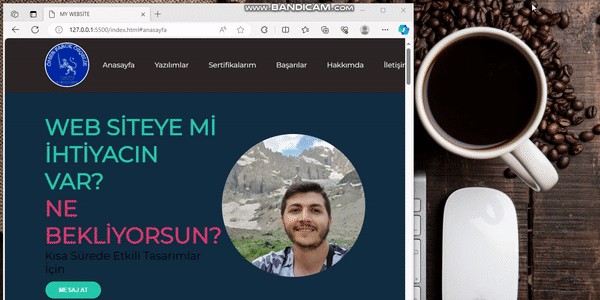

<h1> MY-IT-WEBSITE </h1>

#This repository contains the source codes of the personal website. This project aims to create a simple website that showcases your resume and projects.

<h2> Technologies </h2>

HTML & CSS:** Used to create the basic structure and style of the web page.
JavaScript:** Used to manage dynamic elements of the web page.
Font Awesome:** Used for social media icons and other icons.
Google Fonts:** Used for Montserrat font.

<h2> Page Components </h2>

Homepage:** A quick login and contact button.
Software:** Programming languages and capabilities used.
Certifications:** Certifications and ratings you have received.
Achievements:** Your work achievements and statistical information.
About Me:** Your personal story and quotes from testimonials.
Contact:** A contact form for those who want to reach you.

<h2> SCREENSHOT </h2>

